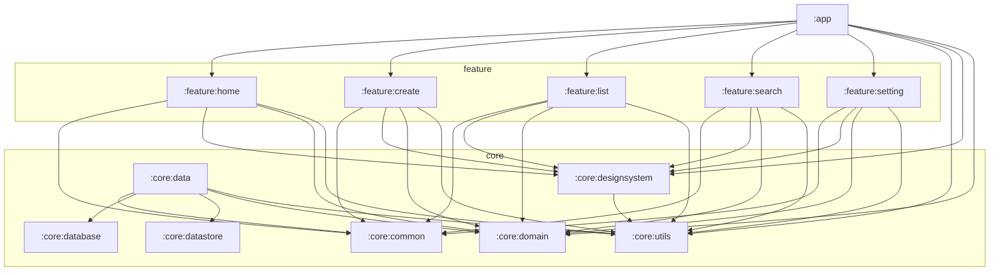

# :app module

```mermaid
flowchart TD
app[:app]

app --> home
app --> create
app --> list
app --> search
app --> setting
app --> utils
app --> designsystem
app --> domain

subgraph feature
    home[:feature:home]
    create[:feature:create]
    list[:feature:list]
    search[:feature:search]
    setting[:feature:setting]
end

home --> common
home --> designsystem
home --> domain
home --> utils

create --> common
create --> designsystem
create --> domain
create --> utils

list --> common
list --> designsystem
list --> domain
list --> utils

search --> common
search --> designsystem
search --> domain
search --> utils

setting --> common
setting --> designsystem
setting --> domain
setting --> utils

subgraph core
    designsystem[:core:designsystem]
    domain[:core:domain]
    common[:core:common]
    utils[:core:utils]
    data[:core:data]
    database[:core:database]
    datastore[:core:datastore]
end

designsystem --> utils

data --> common
data --> database
data --> datastore
data --> domain
data --> utils
```