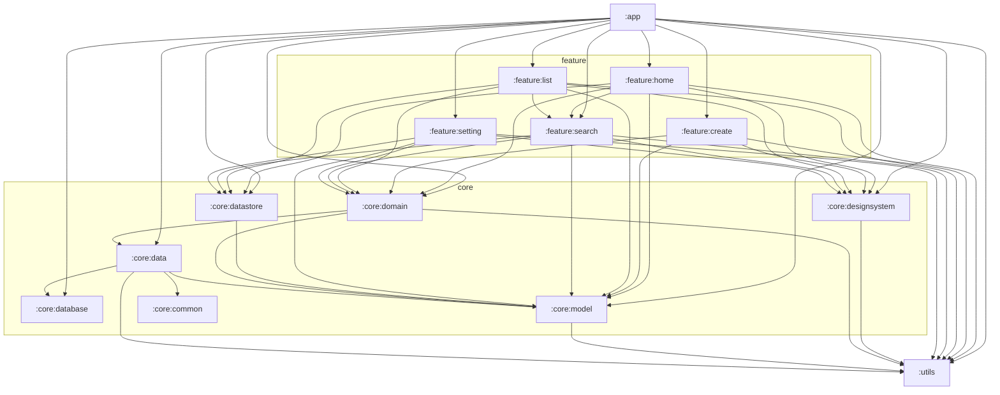

# :app module

```mermaid
flowchart TD
app[:app]

app --> home
app --> create
app --> list
app --> search
app --> setting
app --> utils
app --> data
app --> database
app --> datastore
app --> designsystem
app --> domain
app --> model

subgraph feature
    home[:feature:home]
    create[:feature:create]
    list[:feature:list]
    search[:feature:search]
    setting[:feature:setting]
end

home --> datastore
home --> domain
home --> model
home --> search
home --> designsystem
home --> utils

create --> designsystem
create --> domain
create --> model
create --> utils

list --> search
list --> datastore
list --> designsystem
list --> domain
list --> model
list --> utils

search --> datastore
search --> designsystem
search --> domain
search --> model
search --> utils

setting --> datastore
setting --> designsystem
setting --> domain
setting --> model
setting --> utils

subgraph core
    common[:core:common]
    data[:core:data]
    database[:core:database]
    datastore[:core:datastore]
    designsystem[:core:designsystem]
    domain[:core:domain]
    model[:core:model]
end

datastore --> model

designsystem --> utils

domain --> model
domain --> data
domain --> utils

model --> utils

data --> common
data --> database
data --> model
data --> utils

utils[:utils]
```