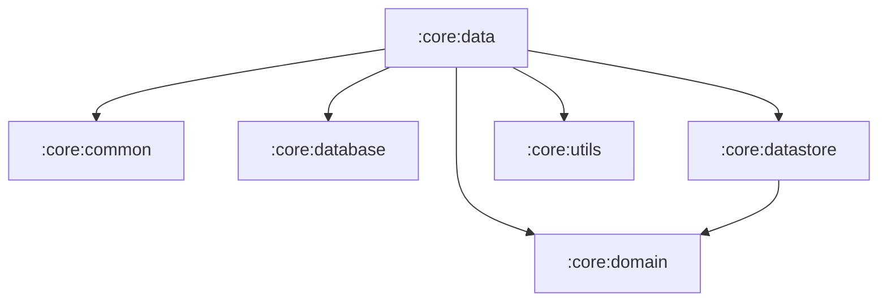

# :core:data module

```mermaid
flowchart TD
data[:core:data]

data --> common
data --> database
data --> datastore
data --> domain
data --> utils

datastore[:core:datastore]
datastore --> domain

domain[:core:domain]

common[:core:common]
database[:core:database]
utils[:core:utils]
```

## 役割
* Repository実装クラスを配置
* RepositoryのDIモジュールを配置
