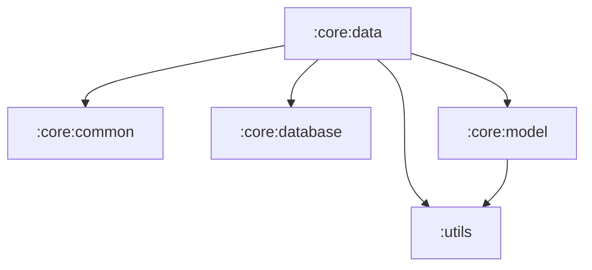

# :core:data module

## 役割
* 各種Repositoryの実装クラスを配置
  * Room関連（履歴、お気に入り、作成済みのQR）
  * Tink関連（暗号化、複合）
  * Jsoup関連（サイト名取得）
  * Zxing関連（QR作成）
* 各種RepositoryのDIロジックを配置
* data class変換用のコンバーターを配置（Domain Model ↔︎ Room Entity）