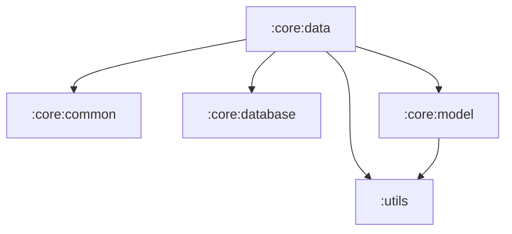

# :core:data module

```mermaid
flowchart TD
data[:core:data]
data --> common
data --> database
data --> model
data --> utils

model[:core:model]
model --> utils

utils[:utils]
database[:core:database]
common[:core:common]
```