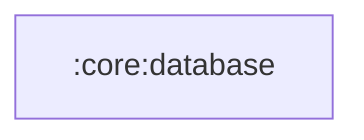

# :core:database module

```mermaid
flowchart TD
database[:core:database]
```

## 役割
* Room関連のロジックを配置
  * Jsonスキーム
  * 各種Entity（テーブル）
  * 各種Dao（クエリ）
  * Database（テーブル挿入、バージョン管理）
  * 各種Dao、DatabaseのDIモジュール