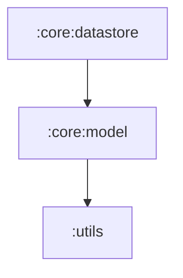

# :core:datastore module

```mermaid
flowchart TD
datastore[:core:datastore]

datastore --> model

model[:core:model]
model --> utils

utils[:utils]
```

## 役割
* DataStore関連ロジックを配置
  * ユーザー設定情報のRepositoryインタフェース、及び、実装クラス
  * DataStore、ユーザー設定情報RepositoryのDIモジュール

## 補足
ユーザー設定情報 : ダイナミックカラー、ダークモード、履歴保存の要否、スキャン機能のオプションの設定情報
