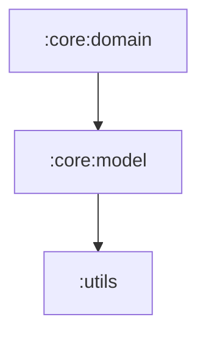

# :core:domain module

```mermaid
flowchart TD
domain[:core:domain]

domain --> model

model[:core:model]
model --> utils

utils[:utils]
```

## 役割
* 各種Repositoryのインタフェースを配置
 * :core:dataモジュールで実装するRepositoryのインタフェース
* 各種UseCaseを配置