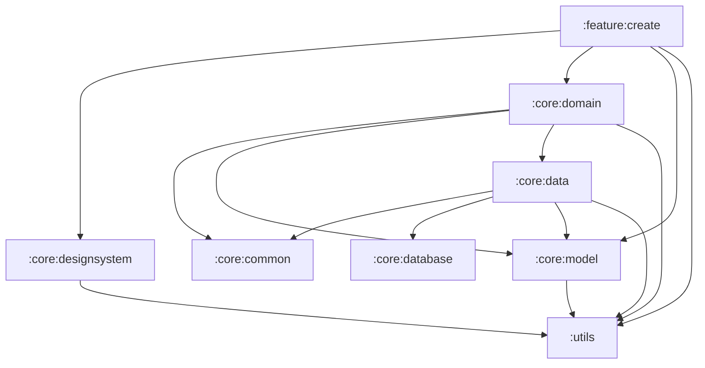

# :feature:create module

```mermaid
flowchart TD
create[:feature:create]

create --> designsystem
create --> domain
create --> model
create --> utils

domain[:core:domain]
domain --> common
domain --> model
domain --> data
domain --> utils

model[:core:model]
model --> utils

designsystem[:core:designsystem]
designsystem --> utils

utils[:utils]

data[:core:data]
data --> common
data --> database
data --> model
data --> utils

database[:core:database]
common[:core:common]
```
