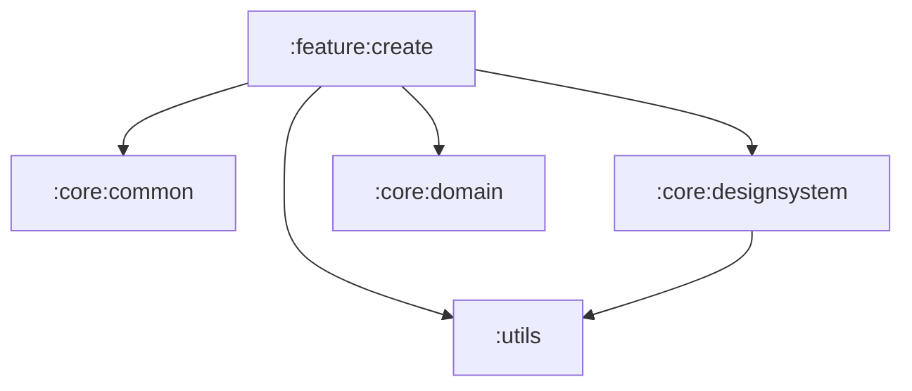

# :feature:create module

```mermaid
flowchart TD
create[:feature:create]

create --> common
create --> designsystem
create --> domain
create --> utils

common[:core:common]

designsystem[:core:designsystem]
designsystem --> utils

domain[:core:domain]

utils[:utils]
```

## 役割

QR作成種類選択画面、QR作成画面、作成済みQRコード一覧画面、作成済みQRコード詳細画面関連のロジックを配置

* Navigation関連のロジックを配置
* 画面UI関連のロジックを配置
* ViewModelを配置