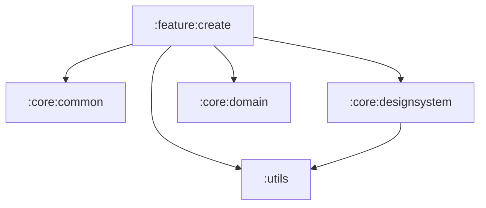

# :feature:create module

```mermaid
flowchart TD
create[:feature:create]

create --> common
create --> designsystem
create --> domain
create --> utils

common[:core:common]

designsystem[:core:designsystem]
designsystem --> utils

domain[:core:domain]

utils[:utils]
```
