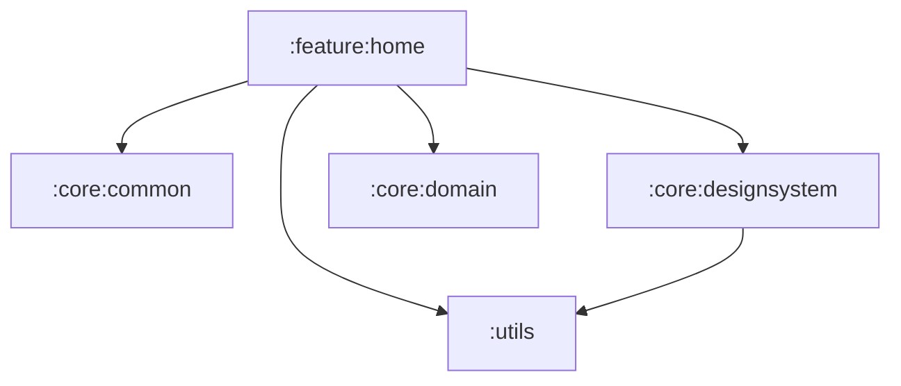

# :feature:home module

```mermaid
flowchart TD
home[:feature:home]

home --> common
home --> designsystem
home --> domain
home --> utils

common[:core:common]

designsystem[:core:designsystem]
designsystem --> utils

domain[:core:domain]

utils[:utils]
```

## 役割

ホーム画面関連のロジックを配置

* Navigation関連のロジックを配置
* 画面UI関連のロジックを配置
* ViewModelを配置