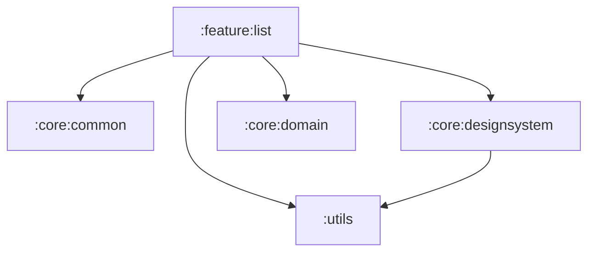

# :feature:list module

```mermaid
flowchart TD
list[:feature:list]

list --> common
list --> designsystem
list --> domain
list --> utils

common[:core:common]

designsystem[:core:designsystem]
designsystem --> utils

domain[:core:domain]

utils[:utils]
```