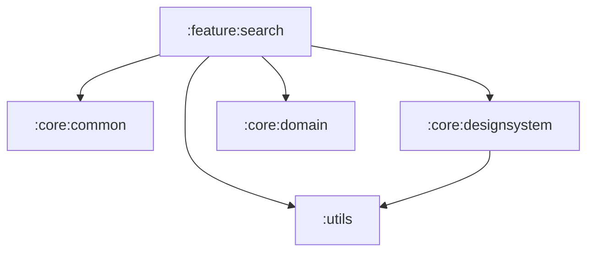

# :feature:search module

```mermaid
flowchart TD
search[:feature:search]

search --> common
search --> designsystem
search --> domain
search --> utils

common[:core:common]

designsystem[:core:designsystem]
designsystem --> utils

domain[:core:domain]

utils[:utils]
```

## 役割

検索画面関連のロジックを配置

* Navigation関連のロジックを配置
* 画面UI関連のロジックを配置
* ViewModelを配置