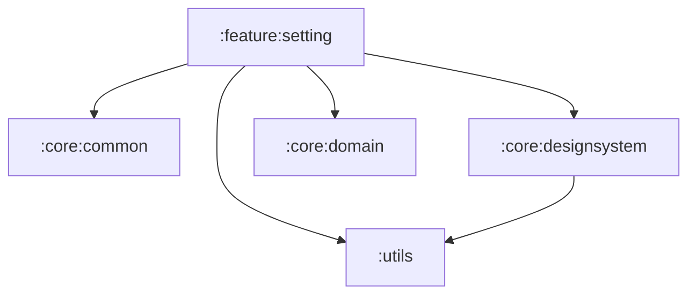

# :feature:setting module

```mermaid
flowchart TD
setting[:feature:setting]

setting --> common
setting --> designsystem
setting --> domain
setting --> utils

common[:core:common]

designsystem[:core:designsystem]
designsystem --> utils

domain[:core:domain]

utils[:utils]
```