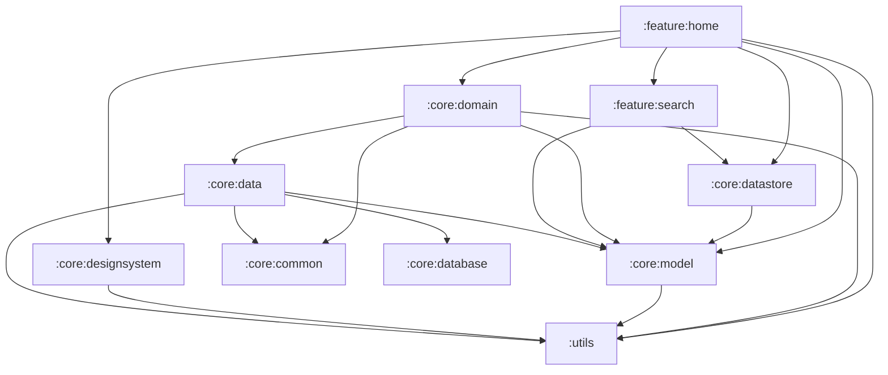

# :feature:home module

```mermaid
flowchart TD
home[:feature:home]

home --> datastore
home --> domain
home --> model
home --> search
home --> designsystem
home --> utils

datastore[:core:datastore]
datastore --> model

domain[:core:domain]
domain --> common
domain --> model
domain --> data
domain --> utils

model[:core:model]
model --> utils

search[:feature:search]
search --> datastore
search --> model

designsystem[:core:designsystem]
designsystem --> utils

utils[:utils]

data[:core:data]
data --> common
data --> database
data --> model
data --> utils

database[:core:database]
common[:core:common]
```