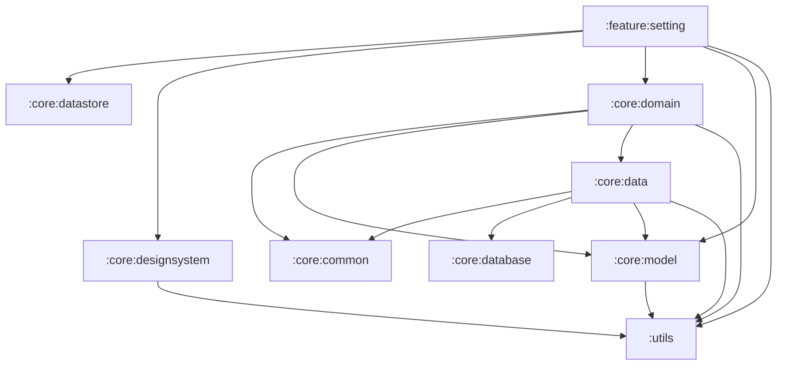

# :feature:setting module

```mermaid
flowchart TD
setting[:feature:setting]

setting --> datastore
setting --> designsystem
setting --> domain
setting --> model
setting --> utils

designsystem[:core:designsystem]
designsystem --> utils

domain[:core:domain]
domain --> common
domain --> model
domain --> data
domain --> utils

model[:core:model]
model --> utils

data[:core:data]
data --> common
data --> database
data --> model
data --> utils

datastore[:core:datastore]

utils[:utils]
database[:core:database]
common[:core:common]
```