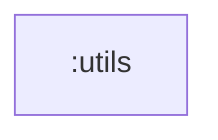

# :utils module

```mermaid
flowchart TD
utils[:utils]
```

## 役割
* 定数の配置
* Contextの拡張関数の配置（Chrome Custom Tabsの起動、他アプリとのIntent共有関連）
* 独自のFlow combine関数の配置（5つ以上のFlowパラメータ）
* Stringの拡張関数の配置（URL文言の判定、クレンジング関連（文字列の改行、空白の除去など）
* QR作成用のスキームを配置
