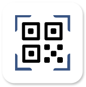

  
  

    
コードリーダー

    

      QR/バーコードをスキャンするAndroidアプリ
    

  

    

        開発期間 : 2025/2〜2025/5 
        総作業時間の目安 : 週20時間 × 4週 
        リリース状況 : 非公開
    

## 開発背景

市場には既に多くのQRコードスキャンアプリが存在します。

その中にはダウンロード数が5億以上、レビュー評価が4.6のアプリもあります。

ダウンロード数が5億に届かないにしても、1000万以上、100万以上、レビュー評価が4以上と多くの人に愛される素晴らしいアプリばかりです。

しかし、どんなに素晴らしいアプリであっても、使っているうちに「こういう風にした方がいいかも？」なんて思うこともあります。

コードリーダーは、「こういう風にした方がいいかも？」の課題に対して私がどのようなアプローチで解決するかを示すために開発しました。

## 課題と解決方法

| No. | 課題 | 詳細 | 解決方法 |
| - | - | - | - |
| 1 | タップする回数を削減 | 目的の画面に辿り着くまでに必要な操作回数が多くもどかしさを感じた。 某アプリでは直近のスキャン結果の確認に**4回**のタップを要した。  1. アプリ起動 2. ハンバーガーメニューをタップ 3. ドロワーメニューの履歴ボタンをタップ 4. 履歴一覧から直近のスキャン結果をタップ | ホーム画面に直近のスキャン結果を表示するためのUIを配置して最短**2回**のタップで確認可能にする。  1. アプリ起動 2. 直近のスキャン結果をタップ |
| 2 | 一覧表示のアイテムを見分けやすく | 一覧に複数のURL形式のアイテムが並ぶ。 ラベルにURL（https://〜）のみが設定されていた。 URLのみで見分けられる場合もあるが、少し見分けにくさを感じた。  日常生活でURL形式のQRをスキャンする頻度は多いように思う。（店舗紹介や商品紹介、飲食店のメニューなど） そのため、見分けにくさの解消は大切な課題と判断。 | URLからサイトのページ名、ファビコンを取得して表示する。 |
| 3 | 検索機能を使いやすく | フリーワード検索機能を搭載していると検索がスムーズに行えるが、文字を入力しなくてもある程度絞り込めた方が楽だと思う。 | フリーワード検索機能と絞り込み条件を設定する機能を追加する。 |
| 4 | 詳細画面を見やすく整理 | 詳細画面にスキャン結果のデータを羅列しているだけのアプリを幾つか見た。 大抵の場合、表示されているデータを見れば何のデータかを判断できると思う。 けれど、項目名を併せて表示した方が誤解もなく、スッキリした見た目になるように思う。 | データを整理して表形式で表示する。 煩わしくない表現で項目名も表示する。 |
| 5 | 文字を入力しやすく | QR作成機能を備えたQRスキャンアプリは多い。 QRを作成するときの情報入力画面で幾つか操作をしずらい点を見つけた。  ・セーフエリアがない ・IMEアクション制御がない（次へ、決定） ・入力完了ボタンをタップ後にバリデーションエラーメッセージが表示されるが、入力フォームに入力形式の記載がなく少し不親切 ・入力画面表示時に入力フォームにオートフォーカスした方が便利かも | ・セーフエリアを設定 ・プレースホルダーに文字の入力形式を明記 ・入力バリデーションの作成 ・入力項目に合わせて表示するキーボードを変更（数字、英語など） ・IMEアクション制御（次へ、決定） ・入力画面表示時のオートフォーカス + キーボード表示 ・入力フォームの枠色の設定（未入力、入力中、入力済） ・入力画面を離れる際に確認ダイアログを表示 ・必須の入力項目か否かをラベルで表示 |

## 言語、ライブラリ
* Kotlin
* Jetpack Compose
* Flow
* StateFlow
* Coroutines
* Hilt
* Jetpack Navigation Component
* Adaptive Navigation Suite
* OSS Licenses
* AdMob

## アーキテクチャ
* MVVM
* Clean Architecture
* マルチモジュール
* Version Catalog
* Convention Plugins

## UnitTest
* JUnit4
* Mockito
* Truth
* Turbine

## 非機能

| 分類 | 内容 |
|-----|-----|
| 対応OS | Android OS10以降 |
| パフォーマンス | 通常の利用でストレスを感じない動作速度 |
| セキュリティ | アプリ内データベースに暗号化してデータ保存（Room + Tink） |
| 可用性 | オフラインでも基本操作が可能 （スキャンモジュールがインストール済みの前提） |
| UI/UX | シンプル、且つ、直感的な画面設計 |

## 機能

| 機能名 | 概要 | ライブラリ等 |
|-----|-----|-----|
| QRコード/バーコードのスキャン | 端末のカメラで読み取り、読み取ったデータを解析したのちに保存、表示する | Google Code Scanner、MlKit、Room、Tink、Jetpack Compose |
| スキャン結果の一覧表示 | スキャン結果をリスト形式で表示 | Jetpack Compose、jsoup + Coil（ファビコン表示） |
| スキャン結果の詳細表示 | スキャン結果の詳細データを表形式で表示 | Jetpack Compose、jsoup + Coil（ファビコン表示） |
| スキャン結果の削除 | 一覧表示からの複数選択削除、詳細表示からの削除 | Room、Jetpack Compose |
| スキャン結果の検索 | 任意の検索ワード、追加条件（履歴、お気に入り、各種カテゴリ）、昇順・降順を使用して検索 | Jetpack Compose |
| スキャン結果の共有 | QR画像形式で端末内の他アプリを介して共有 | Zixing、FileProvider、app chooser（Intent） |
| スキャン結果の他アプリ連携 | URL形式データのブラウザ表示、カレンダーイベント形式データのカレンダー保存・イベント開催場所のGoogle Map検索、 連絡先形式データの電話帳登録、電話番号形式データの電話発信、メール形式データのメール作成、 SMS形式データのSMS作成、位置情報形式データのGoogle Map検索 | Chrome Custom Tabs、app chooser（Intent） |
| QRコードの作成 | URL、Wi-Fi設定情報、カレンダーイベント、連絡先、メール、SMS、電話番号、位置情報、テキスト（文章）形式のQRコードを作成 | Zixing |
| 作成したQRコードの一覧表示 | 作成したQRコードをリスト形式で表示 | Jetpack Compose、jsoup + Coil（ファビコン表示） |
| 作成したQRコードの詳細表示 | 作成したQRコードの詳細データを表形式で表示 | Jetpack Compose、jsoup + Coil（ファビコン表示） |
| 作成したQRコードの削除 | 一覧表示からの複数選択削除、詳細表示からの削除 | Room、Jetpack Compose |
| 作成したQRコードの共有 | QR画像形式で端末内の他アプリを介して共有 | Zixing、FileProvider、app chooser（Intent） |
| スキャン機能のオプション設定 | スキャンする対象の形式に合わせてスキャン精度を上げる （QR CODE、AZTEC、CODE128、CODE39、CODE93、CODEBAR、DATA MATRIX、ITF、PDF417） | Google Code Scanner、MlKit |
| アプリのテーマ切り替え | ダイナミックカラー、ダークモード | Jetpack Compose、DataStore |

## モジュール構成

### app

* [app](module/app.md)

### feature

* [home](module/feature/home.md)
* [create](module/feature/create.md)
* [list](module/feature/list.md)
* [search](module/feature/search.md)
* [setting](module/feature/setting.md)

### core

* [common](module/core/common.md)
* [data](module/core/data.md)
* [datastrore](module/core/datastrore.md)
* [designsystem](module/core/designsystem.md)
* [domain](module/core/domain.md)
* [model](module/core/model.md)

### utils

* [utils](module/utils.md)

## 画面

* [スプラッシュ](screen/splash.md)
* [利用規約同意](screen/agree_terms)
* [ホーム](screen/home.md)
* [QR作成種類選択](screen/choose_create_qr.md)
* [QR作成](screen/create_qr.md)
* [作成済みQRコード一覧](screen/created_qr_list.md)
* [作成済みQRコード詳細](screen/created_qr_detail.md)
* [履歴一覧](screen/history_list.md)
* [履歴詳細](screen/history_detail.md)
* [お気に入り一覧](screen/favorite_list.md)
* [お気に入り詳細](screen/favorite_detail.md)
* [検索](screen/search.md)
* [設定](screen/settings.md)

