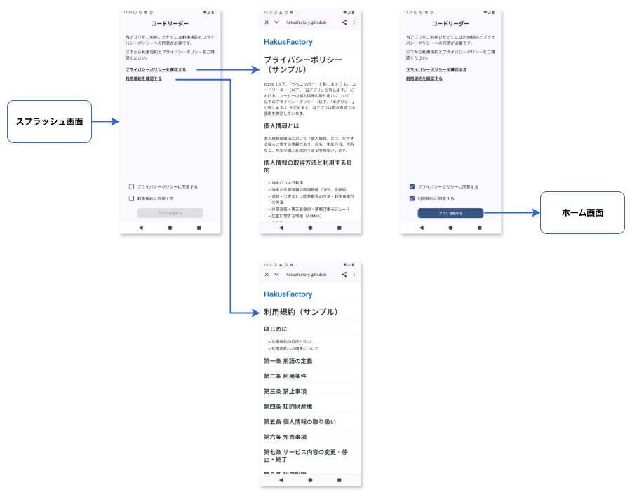
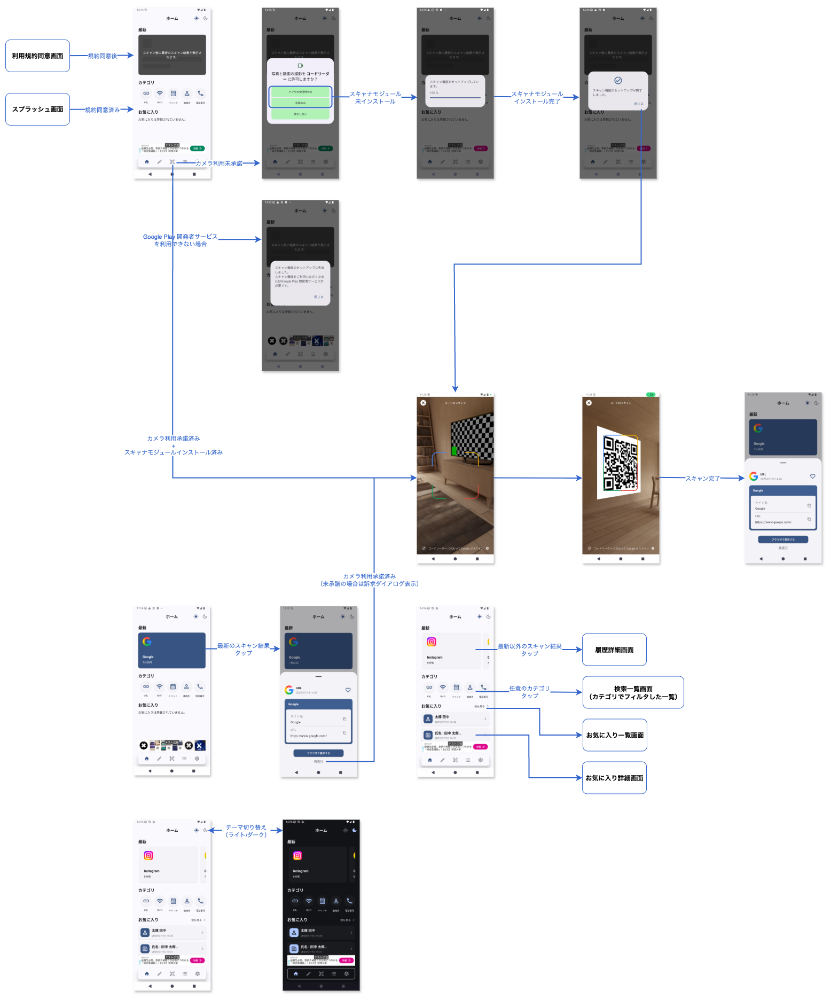

# コードリーダー

## 概要
QR、バーコードのスキャン機能を備えたAndroidアプリ。
Google Play Storeに同様のアプリが多数存在するが、モダンなUIや技術を取り入れているものはそう多くないと感じた。
そこで自らの経験をもとにモダンな印象を与えるアプリを制作。

## 言語、FW、ライブラリ
* Kotlin
* Jetpack Compose
* Android SDK
* Flow
* StateFlow
* Coroutines
* Hilt
* Jetpack Navigation Component
* Adaptive Navigation Suite
* DataStore
* Room
* Google Code Scanner
* MlKit
* Zixing
* Chrome Custom Tabs
* jsoup
* Tink
* Coil
* OSS Licenses
* AdMob

## アーキテクチャ
* MVVM
* Clean Architecture
* マルチモジュール
* Version Catalog
* Convention Plugins

## UnitTest
* JUnit4
* Mockito
* Truth
* Turbine

## 機能
* QRコード、バーコードのスキャン
* スキャンデータの解析
* スキャンデータの詳細表示
* スキャンデータの保存（履歴、お気に入り）
* スキャンデータの削除
* 保存したスキャンデータの検索
* スキャンデータの共有
* スキャンデータ（URL）のブラウザ表示
* スキャンデータ（SMS）のSMSアプリ連携
* スキャンデータ（メール）のメールアプリ連携
* スキャンデータ（電話番号）の電話アプリ連携
* スキャンデータ（位置情報）のGoogle Mapアプリ連携
* スキャンデータ（カレンダーイベント）のカレンダーアプリ連携
* スキャンデータ（連絡先）の電話帳アプリ連携
* QRコードの作成
* 作成したQRコードの詳細表示
* 作成したQRコードの保存
* 作成したQRコードの削除
* 作成したQRコードの共有
* アプリのテーマの切り替え（ダークモード、ダイナミックカラー）
* コードスキャンのオプション設定（QR CODE、AZTEC、CODE128、CODE39、CODEBAR等）
* その他（利用規約、プライバシーポリシー、ライセンス）

## 画面

### スプラッシュ

### 利用規約同意画面

### ホーム

### QR作成種類選択

#### URL形式のQRコード作成

#### Wi-Fi設定情報形式のQRコード作成

#### カレンダーイベント形式のQRコード作成

#### 連絡先形式のQRコード作成

#### 電話番号形式のQRコード作成

#### メール形式のQRコード作成

#### SMS形式のQRコード作成

#### 位置情報形式のQRコード作成

#### テキスト形式のQRコード作成

### 作成済みQRコード一覧

### 作成済みQRコード詳細

### 履歴一覧

### お気に入り一覧

### 履歴詳細

#### URL

#### Wi-Fi

#### カレンダーイベント

#### 連絡先

#### 電話番号

#### メール

#### SMS

#### 位置情報

#### テキスト

### お気に入り詳細

### 検索一覧

### 設定

#### ダイナミックカラー

| 設定 | ホーム | 備考 |
|-----|-----|-----|
|||OFF OS12〜|
|||ON OS12〜|
||-|〜OS11|

#### ダークモード

#### 履歴の保存

#### スキャン設定

#### 利用規約

#### プライバシーポリシー

#### ライセンス

