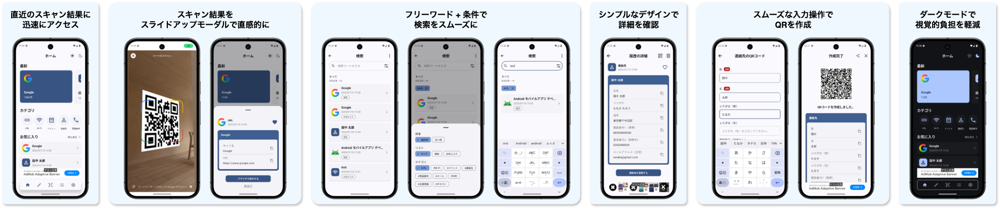

# コードリーダー

## アプリの基本情報
スキャン結果の可視性に特化した、シンプルで使いやすいQR／バーコードスキャン機能を備えたAndroidアプリ。

時間が経ってからスキャン結果を確認する場合でも、目的の情報をすぐに見つけられるような仕組みを採用。

サブ機能としてQRコードの作成機能を備える。

## 開発背景

市場には既に多くのQRコードスキャンアプリが存在します。

しかし、ダウンロード数が5億を超えるアプリであっても、実際に利用すると不便に感じることが少なからずあります。

当アプリは、それらの不便さを参考に私ならどう作るかを示すためのものです。

## 課題と解決方法

| No. | 課題 | 詳細 | 解決方法 |
| - | - | - | - |
| 1 | 操作の手数が必要以上に多い | 過去のスキャン結果の確認に**4回**の操作を必要とするアプリが存在する。  1. アプリ起動 2. ハンバーガーメニューをタップ 3. 履歴ボタンをタップ 4. 履歴一覧から目的のスキャン結果をタップ | ホーム画面に直近のスキャン結果を表示する導線を作成して最短**2回**の操作で確認可能にする。  1. アプリ起動 2. 目的のスキャン結果をタップ |
| 2 | 一覧表示のアイテムを見分けにくい | アイテムがURL形式の場合、タイトルをhttps://〜としているアプリが存在するが、複数のURL形式のアイテムが並んだ場合に見分けにくさを感じた。  日常生活で店舗紹介や商品紹介、飲食店のメニューなど、URL形式のQRをスキャンする頻度は、他の形式のQRよりも多いため改善が必要と感じた。 | URLからサイトのページ名、ファビコンを取得して表示する。 |
| 3 | 検索機能が使いずらい | 検索機能がないアプリも存在するが、搭載していてもフリーワード検索のみの場合がある。 微かな記憶を頼りに検索する場合、フリーワードのみでは少し不便に感じた。 | フリーワードと以下の条件を組み合わせて検索可能にする。  ・データ形式（URL、Wi-Fi、連絡先など） ・お気に入り登録の有無 ・リスト表示の昇順/降順 |
| 4 | 詳細画面の表示 | スキャン結果のデータを羅列しただけのアプリが散見される。  連絡先形式のデータの場合、複数の電話番号、メールアドレスが並ぶことがあるが、せめて自宅、勤務先などのラベルの表示が欲しいところ。 | ・詳細表示の各項目に項目名を表示する ・データの羅列ではなく表形式で整理して表示する |
| 5 | 入力画面のUI/UX | スキャン機能と合わせてQR作成機能を搭載したアプリがいくつかあるが、UI/UXに不足を感じることがあった。 | ・セーフエリアを設定 ・プレースホルダーに文字の入力形式を明記 ・入力バリデーションの作成 ・入力項目に合わせて表示するキーボードを変更（数字、英語など） ・IMEアクション制御（次へ、決定） ・入力画面表示時のオートフォーカス + キーボード表示 ・入力フォームの枠色の設定（未入力、入力中、入力済） ・入力画面を離れる際に確認ダイアログを表示 ・必須の入力項目の明示 |

## 言語、ライブラリ
* Kotlin
* Jetpack Compose
* Flow
* StateFlow
* Coroutines
* Hilt
* Jetpack Navigation Component
* Adaptive Navigation Suite
* OSS Licenses
* AdMob

## アーキテクチャ
* MVVM
* Clean Architecture
* マルチモジュール
* Version Catalog
* Convention Plugins

## UnitTest
* JUnit4
* Mockito
* Truth
* Turbine

## 非機能

| 分類 | 内容 |
|-----|-----|
| 対応OS | Android OS10以降 |
| パフォーマンス | 通常の利用でストレスを感じない動作速度 |
| セキュリティ | アプリ内データベースに暗号化してデータ保存（Room + Tink） |
| 可用性 | オフラインでも基本操作が可能 （スキャンモジュールがインストール済みの前提） |
| UI/UX | シンプル、且つ、直感的な画面設計 |

## 機能

| 機能名 | 概要 | ライブラリ等 |
|-----|-----|-----|
| QRコード/バーコードのスキャン | 端末のカメラで読み取り、読み取ったデータを解析したのちに保存、表示する | Google Code Scanner、MlKit、Room、Tink、Jetpack Compose |
| スキャン結果の一覧表示 | スキャン結果をリスト形式で表示 | Jetpack Compose、jsoup + Coil（ファビコン表示） |
| スキャン結果の詳細表示 | スキャン結果の詳細データを表形式で表示 | Jetpack Compose、jsoup + Coil（ファビコン表示） |
| スキャン結果の削除 | 一覧表示からの複数選択削除、詳細表示からの削除 | Room、Jetpack Compose |
| スキャン結果の検索 | 任意の検索ワード、追加条件（履歴、お気に入り、各種カテゴリ）、昇順・降順を使用して検索 | Jetpack Compose |
| スキャン結果の共有 | QR画像形式で端末内の他アプリを介して共有 | Zixing、FileProvider、app chooser（Intent） |
| スキャン結果の他アプリ連携 | URL形式データのブラウザ表示、カレンダーイベント形式データのカレンダー保存・イベント開催場所のGoogle Map検索、 連絡先形式データの電話帳登録、電話番号形式データの電話発信、メール形式データのメール作成、 SMS形式データのSMS作成、位置情報形式データのGoogle Map検索 | Chrome Custom Tabs、app chooser（Intent） |
| QRコードの作成 | URL、Wi-Fi設定情報、カレンダーイベント、連絡先、メール、SMS、電話番号、位置情報、テキスト（文章）形式のQRコードを作成 | Zixing |
| 作成したQRコードの一覧表示 | 作成したQRコードをリスト形式で表示 | Jetpack Compose、jsoup + Coil（ファビコン表示） |
| 作成したQRコードの詳細表示 | 作成したQRコードの詳細データを表形式で表示 | Jetpack Compose、jsoup + Coil（ファビコン表示） |
| 作成したQRコードの削除 | 一覧表示からの複数選択削除、詳細表示からの削除 | Room、Jetpack Compose |
| 作成したQRコードの共有 | QR画像形式で端末内の他アプリを介して共有 | Zixing、FileProvider、app chooser（Intent） |
| スキャン機能のオプション設定 | スキャンする対象の形式に合わせてスキャン精度を上げる （QR CODE、AZTEC、CODE128、CODE39、CODE93、CODEBAR、DATA MATRIX、ITF、PDF417） | Google Code Scanner、MlKit |
| アプリのテーマ切り替え | ダイナミックカラー、ダークモード | Jetpack Compose、DataStore |

## モジュール構成

### app

* [app](module/app.md)

### feature

* [home](module/feature/home.md)
* [create](module/feature/create.md)
* [list](module/feature/list.md)
* [search](module/feature/search.md)
* [setting](module/feature/setting.md)

### core

* [common](module/core/common.md)
* [data](module/core/data.md)
* [datastrore](module/core/datastrore.md)
* [designsystem](module/core/designsystem.md)
* [domain](module/core/domain.md)
* [model](module/core/model.md)

### utils

* [utils](module/utils.md)

## 画面

* [スプラッシュ](screen/splash.md)
* [利用規約同意](screen/agree_terms)
* [ホーム](screen/home.md)
* [QR作成種類選択](screen/choose_create_qr.md)
* [QR作成](screen/create_qr.md)
* [作成済みQRコード一覧](screen/created_qr_list.md)
* [作成済みQRコード詳細](screen/created_qr_detail.md)
* [履歴一覧](screen/history_list.md)
* [履歴詳細](screen/history_detail.md)
* [お気に入り一覧](screen/favorite_list.md)
* [お気に入り詳細](screen/favorite_detail.md)
* [検索](screen/search.md)
* [設定](screen/settings.md)

